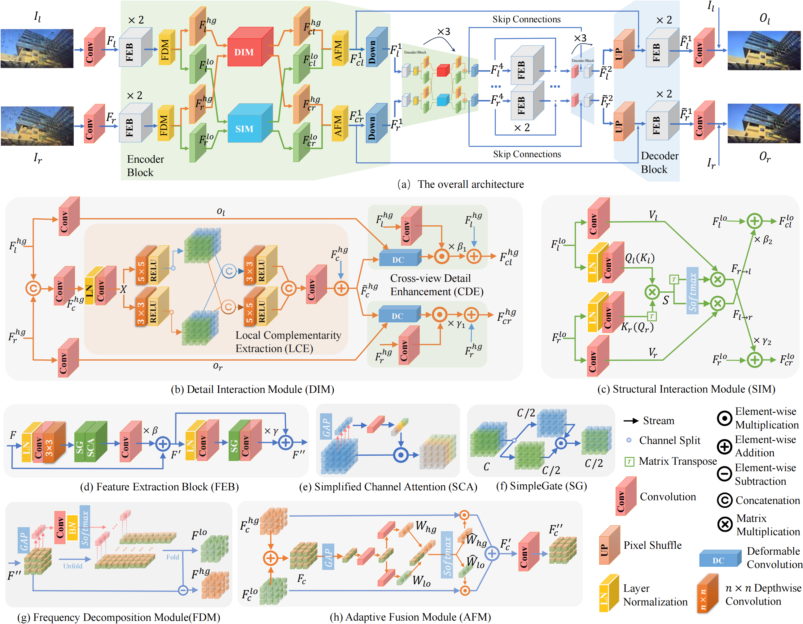
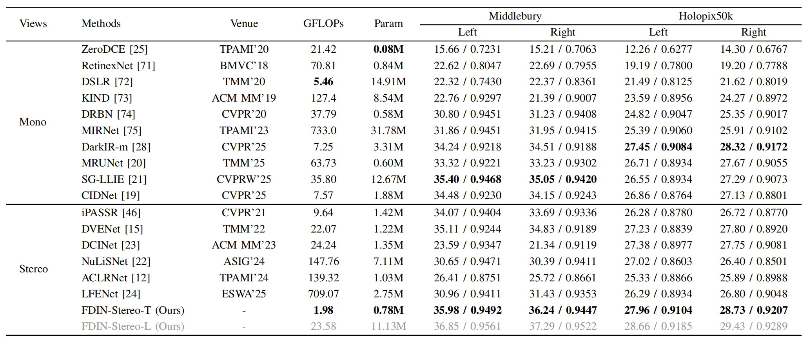
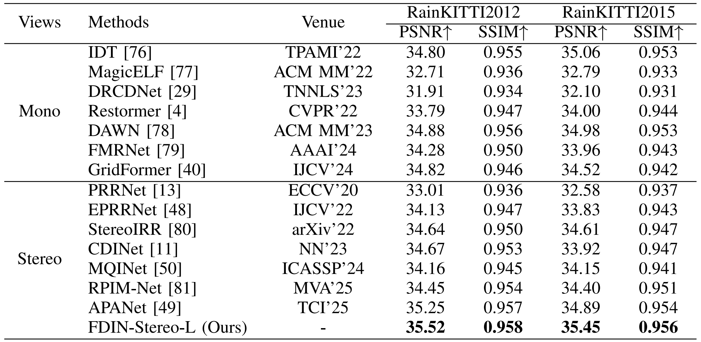
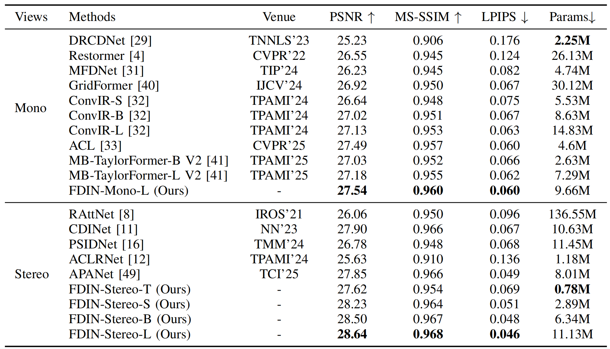
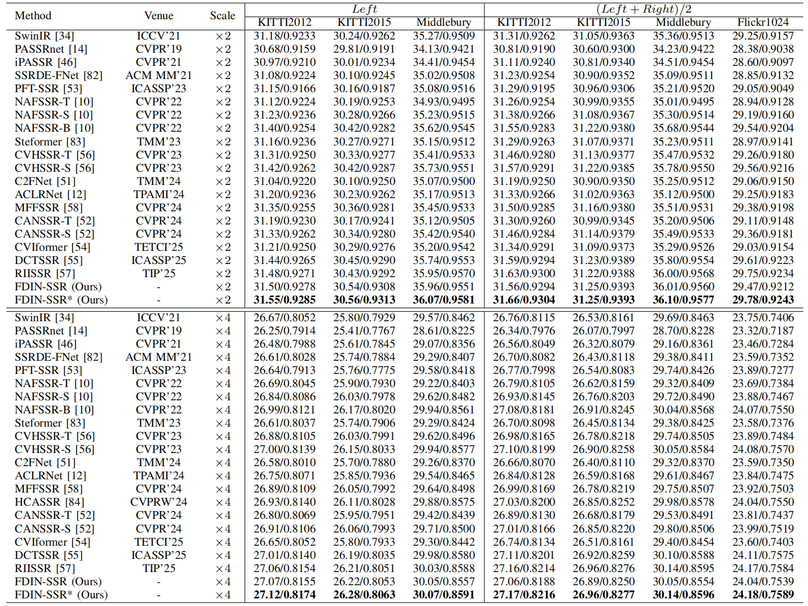

# :fire: Frequency-Decomposed Interaction Network for Stereo Image Restoration

  

> **Abstract:** *Stereo image restoration in adverse environments, such as low-light conditions, rain, and low resolution, requires effective exploitation of cross-view complementary information to recover degraded visual content. In monocular image restoration, frequency decomposition has proven effective, where high-frequency components aid in recovering fine textures and reducing blur, while low-frequency components facilitate noise suppression and illumination correction. However, existing stereo restoration methods have yet to explore cross-view interactions by frequency decomposition, which is a promising direction for enhancing restoration quality. To address this, we propose a frequency-aware framework comprising a Frequency Decomposition Module (FDM), Detail Interaction Module (DIM), Structural Interaction Module (SIM), and Adaptive Fusion Module (AFM). FDM employs learnable filters to decompose the image into high- and low-frequency components. DIM enhances the high-frequency branch by capturing local detail cues through deformable convolution. SIM processes the low-frequency branch by modeling global structural correlations via a cross-view row-wise attention mechanism. Finally, AFM adaptively fuses the complementary frequency-specific information to generate high-quality restored images. Extensive experiments demonstrate the efficacy and generalizability of our framework across three diverse stereo restoration tasks, where it achieves state-of-the-art performance in low-light enhancement, rain removal, alongside highly competitive results in super-resolution.* 

### 📢 News

- **January 18, 2026**: Our work is accepted by TIP 2026.
- **February 2, 2026**: We released the code and pre-trained models.

## Network Architecture

  

## Results Table
Experiments are performed for different stereo image processing tasks including, stereo image low-light enhancement, rain streak removal, raindrop removal, and super-resolution. 

<strong>Stereo image low-light enhancement</strong> (click to expand) 

  

<strong>Stereo image rain streak removal</strong> (click to expand) 

  

<strong>Stereo image raindrop removal</strong> (click to expand) 

  

<strong>Stereo image super-resolution</strong> (click to expand) 

  

### Download
|Tasks| Stereo image low-light enhancement | Stereo image rain streak removal | Stereo image raindrop removal| Stereo image super-resolution |
|:--:|:--:|:--:|:--:|:--:|
|Test Results| [Download](https://drive.google.com/drive/folders/1VwvQIIjYv1hbJt_nXkkxNR2zN9lt5Drh?usp=sharing)|[Download](https://drive.google.com/drive/folders/1VwvQIIjYv1hbJt_nXkkxNR2zN9lt5Drh?usp=sharing)|[Download](https://drive.google.com/drive/folders/1VwvQIIjYv1hbJt_nXkkxNR2zN9lt5Drh?usp=sharing)|[Download](https://drive.google.com/drive/folders/1VwvQIIjYv1hbJt_nXkkxNR2zN9lt5Drh?usp=sharing)|
|Pre-trained model| [Download](https://drive.google.com/drive/folders/1VwvQIIjYv1hbJt_nXkkxNR2zN9lt5Drh?usp=sharing)|[Download](https://drive.google.com/drive/folders/1VwvQIIjYv1hbJt_nXkkxNR2zN9lt5Drh?usp=sharing)|[Download](https://drive.google.com/drive/folders/1VwvQIIjYv1hbJt_nXkkxNR2zN9lt5Drh?usp=sharing)|[Download](https://drive.google.com/drive/folders/1VwvQIIjYv1hbJt_nXkkxNR2zN9lt5Drh?usp=sharing)|

## Installation

See [INSTALL.md](INSTALL.md) for the installation of dependencies required to run Restormer.

## Training and Evaluation

Training and Testing instructions for Deraining, Motion Deblurring, Defocus Deblurring, and Denoising are provided in their respective directories. Here is a summary table containing hyperlinks for easy navigation:

<table>
  <tr>
    <th align="left">Task</th>
    <th align="center">Training Instructions</th>
    <th align="center">Testing Instructions</th>
    <th align="center">Restormer's Visual Results</th>
  </tr>
  <tr>
    <td align="left">Deraining</td>
    <td align="center"><a href="Deraining/README.md#training">Link</a></td>
    <td align="center"><a href="Deraining/README.md#evaluation">Link</a></td>
    <td align="center"><a href="https://drive.google.com/drive/folders/1HcLc6v03q_sP_lRPcl7_NJmlB9f48TWU?usp=sharing">Download</a></td>
  </tr>
  <tr>
    <td>Motion Deblurring</td>
    <td align="center"><a href="Motion_Deblurring/README.md#training">Link</a></td>
    <td align="center"><a href="Motion_Deblurring/README.md#evaluation">Link</a></td>
    <td align="center"><a href="https://drive.google.com/drive/folders/1qla3HEOuGapv1hqBwXEMi2USFPB2qmx_?usp=sharing">Download</a></td>
  </tr>
  <tr>
    <td>Defocus Deblurring</td>
    <td align="center"><a href="Defocus_Deblurring/README.md#training">Link</a></td>
    <td align="center"><a href="Defocus_Deblurring/README.md#evaluation">Link</a></td>
    <td align="center"><a href="https://drive.google.com/drive/folders/1V_pLc9CZFe4vN7c4SxtXsXKi2FnLUt98?usp=sharing">Download</a></td>
  </tr>
  <tr>
    <td>Gaussian Denoising</td>
    <td align="center"><a href="Denoising/README.md#training">Link</a></td>
    <td align="center"><a href="Denoising/README.md#evaluation">Link</a></td>
    <td align="center"><a href="https://drive.google.com/drive/folders/1rEAHUBkA9uCe9Q0AzI5zkYxePSgxYDEG?usp=sharing">Download</a></td>
  </tr>
  <tr>
    <td>Real Denoising</td>
    <td align="center"><a href="Denoising/README.md#training-1">Link</a></td>
    <td align="center"><a href="Denoising/README.md#evaluation-1">Link</a></td>
    <td align="center"><a href="https://drive.google.com/file/d/1CsEiN6R0hlmEoSTyy48nnhfF06P5aRR7/view?usp=sharing">Download</a></td>
  </tr>
</table>

## :book: Citation
If our work is helpful to your research, please cite our paper following this.

@ARTICLE{11370448,
  author={Tian, Xianmin and Xie, Jin and Xu, Ronghua and Nie, Jing and Cao, Jiale and Pang, Yanwei and Li, Xuelong},
  journal={IEEE Transactions on Image Processing}, 
  title={Frequency-Decomposed Interaction Network for Stereo Image Restoration}, 
  year={2026},
  volume={35},
  pages={1462-1477},
  doi={10.1109/TIP.2026.3658219}
  }

## :postbox: Contact
If you have any questions, please feel free to reach us out at <a href="20201640@cqu.edu.cn">20201640@cqu.edu.cn</a>.

## ❤️ Acknowledgments
This code is based on the [BasicSR](https://github.com/xinntao/BasicSR) toolbox and [NAFNet](https://github.com/megvii-research/NAFNet), thanks for their excellent work!

